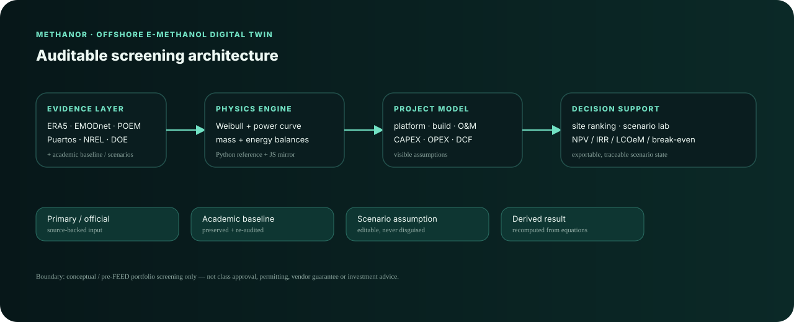

# MethaNor — Conceptual Offshore e-Methanol Digital Twin

**Conceptual engineering · offshore wind · Power-to-X · naval architecture · technology selection · geospatial screening · techno-economics**

MethaNor is an interactive, bilingual and source-traceable screening platform for an offshore e-methanol concept in the Cantabrian Sea. It is an independent software evolution of my 2026 BSc thesis in Marine Engineering at Universidad de Cantabria.

> **Scope:** conceptual / pre-FEED portfolio screening and decision support. It is **not** class approval, detailed design, HAZOP, a permitting opinion, a vendor quotation or investment advice.

## Live project & engineering studies

- **[Live Demo — MethaNor](https://aaronexposito0-creator.github.io/methanor-offshore-emethanol-digital-twin/)**
- **[Engineering Study — Español](docs/MethaNor_Offshore_e-Methanol_Engineering_Study_ES.pdf)**
- **[Engineering Study — English](docs/MethaNor_Offshore_eMethanol_Engineering_Study_EN.pdf)**

The two PDF studies are publication-ready companion documents to the interactive platform. They present the engineering rationale, corrected energy-conservation basis, techno-economic screening logic, traceable assumptions and the roadmap from academic concept to a defensible pre-FEED-style study.




## Why it exists

The original thesis connected a 15 MW floating wind turbine, PEM electrolysis, direct-air capture, methanol synthesis, a semisubmersible platform and project finance. Rebuilding the concept as executable software exposed a central conservation problem: the thesis headline production of ~51,058 t/y cannot be powered by a **single 15 MW** energy source under the stated process intensities.

MethaNor makes the correction explicit instead of hiding it:

- **15 MW unit** → naval / engineering reference.
- **150 MW hub** → 10 × 15 MW commercial screening architecture.
- **Production** → always solved from available electricity and process intensity.
- **Economics** → always recomputed from the current physical scenario.
- **Evidence** → every important value is classified as sourced evidence, academic baseline, scenario assumption or derived result.

## V4.2 final highlights — Publication QA release

- Final EN/ES linguistic QA across static copy, dynamic vendor fields, risk categories and source-use descriptions.
- Explicit **Portfolio Fit** methodology with visible weights and a clear non-procurement disclaimer.
- Source-date governance now distinguishes dated references from live technical pages and records access date.
- Public manufacturer data remain source-linked; absent prices and unsupported performance values remain explicitly absent.

- **English / Spanish interface** with persistent language selection.
- **Executive decision snapshot** that separates physical conclusions, site-data gaps, technology evidence and scenario-dependent economics.
- **Interactive real basemap** with satellite and map modes, zoom/pan, clickable candidate sites and arbitrary coordinate screening. Map pins are coordinate-centred (labels no longer shift the marker), custom points use hover/focus labels, and the selected point can be centred or copied.
- Direct **Google Maps**, ERA5, EMODnet and POEM links from the selected site.
- Explicit geospatial data-gap governance: no shipping, protected-area or permitting conclusion is invented when an AIS/GIS layer is not embedded.
- **Technology & Vendor Explorer** covering 10 electrolysis candidates plus methanol synthesis, DAC and water-treatment candidates.
- **A/B/C technology comparison** for public vendor specifications, with unpublished fields kept blank instead of inferred.
- Public manufacturer specifications, official technical links, transparent portfolio-fit scoring and no fabricated vendor pricing.
- Technology selection is saved by category; a numerical scenario input changes only when a defensible public value is present.
- **Mass & Space Budget** reconstructed from the thesis weight and vertical-moment register: 24,000 t and 505,757 t·m, with derived KG ≈ 21.07 m.
- **Concept Risk Register** with a 5×5 probability-impact matrix, owners, mitigations and evidence status. It is explicitly not a HAZOP.
- **Scenario comparison A/B/C** for physical and financial assumptions.
- **Design Decision Log** documenting rationale, alternatives, trade-offs and evidence.
- Native **Methodology**, **Evidence** and **Project Origin** sections — no raw Markdown detour from the application.
- Independent Python reference engine, browser JavaScript model and automated validation.

## Model architecture

```text
Primary / official references ─┐
Academic thesis baseline ──────┼─> evidence-labelled inputs
Scenario assumptions ──────────┘
                                  ↓
Site context + technology configuration
                                  ↓
Weibull wind → IEA 15 MW screening power curve → annual electricity
                                  ↓
PEM + DAC + synthesis + water + BoP specific energy
                                  ↓
stoichiometric H2 / CO2 / MeOH mass balance
                                  ↓
naval mass/space budget + delivery + O&M + concept risks
                                  ↓
25-year DCF → NPV / IRR / LCOeM / payback / break-even conditions
```

## Technology-selection philosophy

MethaNor does **not** claim that one supplier is universally “best”. The explorer ranks public candidates using visible portfolio-fit criteria such as scale, dynamics, maturity, integration and evidence quality.

A vendor selection has two possible effects:

1. **Configuration only** — the selection is recorded and exported, but the scenario equations are unchanged when no defensible public numerical value exists.
2. **Configuration + numerical update** — a scenario input is updated only when a public technical value can be traced to the manufacturer or a cited source.

Commercial price fields intentionally show **“vendor quote required”** unless an actual public quotation exists. Literature cost benchmarks are kept separate from supplier pricing.

## Geospatial-screening philosophy

The V4.2 map uses real geographic coordinates and third-party basemaps for visual context. Clicking a point returns a screening preview, nearest-port distance and direct links to the relevant official data portals.

The bundled candidate table contains:

- one **academic thesis reference point**; and
- illustrative comparison points for UI demonstration.

For arbitrary clicks, wind/depth preview values are interpolated from the bundled anchors and are clearly labelled as such. They are **not** presented as ERA5 or EMODnet samples.

A professional site-selection upgrade would ingest:

- ERA5 hourly wind/wave time series;
- EMODnet bathymetric DTM;
- MITECO POEM GIS polygons;
- Puertos del Estado measured/forecast metocean data;
- a legally usable AIS shipping-density layer;
- protected-area, cable/pipeline and other constraint layers.

The application deliberately says “data required” rather than making up claims such as “too many ships” or “permitting impossible”.

## Repository

```text
MethaNor-Offshore-eMethanol-Digital-Twin-V4.2/
├─ index.html
├─ assets/
│  ├─ app.js                     # browser model, map and UI
│  ├─ styles.css                 # responsive design system
│  ├─ logo.svg
│  ├─ architecture.svg
│  └─ social-preview.png          # LinkedIn / social sharing preview
├─ data/
│  ├─ assumptions.json
│  ├─ baseline.json              # generated by Python engine
│  ├─ sites.json                 # provenance-labelled site points
│  ├─ sources.json               # evidence registry
│  ├─ technology_catalog.json    # vendor/technology shortlist
│  ├─ risks.json                 # concept risk register
│  └─ mass_space.json            # thesis mass/space register
├─ engine/
│  └─ methanor.py                # independent scientific reference engine
├─ tests/
│  ├─ test_engine.py
│  ├─ test_repository.py
│  └─ test_v4.py                 # final UI/data/integrity gates
├─ docs/
│  ├─ METHODOLOGY.md
│  ├─ SCIENTIFIC_AUDIT.md
│  ├─ DATA_SOURCES.md
│  ├─ ASSUMPTIONS.md
│  ├─ ORIGIN.md
│  ├─ VALIDATION.md
│  ├─ DEPLOYMENT.md
│  ├─ INTERVIEW_CHEATSHEET.md
│  └─ FINAL_QA.md
├─ run_local.bat
├─ run_local.sh
└─ .github/workflows/ci.yml
```

## Final QA gates

The packaged release is checked for physics/finance invariants, source traceability, technology catalogue integrity, mass closure, risk-register bounds, bilingual site behaviour, JavaScript syntax, duplicate HTML IDs, internal anchors and missing local assets. See `docs/VALIDATION.md`.

## Run locally

No web-framework dependency is required.

```bash
python -m http.server 8000
```

Open `http://localhost:8000`.

On Windows, double-click `run_local.bat`.

Regenerate the scientific baseline and run validation:

```bash
python engine/methanor.py
python -m pytest -q
node --check assets/app.js
```

## Evidence model

Every important value belongs to one of four classes:

1. **Primary / official evidence** — NREL/IEA Wind TCP, U.S. DOE, ERA5, EMODnet, MITECO, Puertos del Estado, IRENA, IEA and official manufacturer documentation.
2. **Academic baseline** — inherited from the thesis and explicitly re-audited before reuse.
3. **Scenario assumption** — editable commercial or project-planning input.
4. **Derived result** — recomputed from equations and the current scenario.

Basemap imagery is **visual context only** and is never treated as engineering evidence.

## Scientific boundary

MethaNor is designed to help answer questions such as:

- Is the production target energetically possible?
- Which assumptions dominate viability?
- Which public technology candidates fit the concept and why?
- What methanol price, CAPEX, grant or WACC would make NPV zero?
- How does the concept scale from one 15 MW unit to a commercial hub?
- Which masses and deck envelopes come from the thesis?
- Which risks and missing datasets must be resolved before FEED?

It does **not** claim to answer class, hydrodynamic, structural, hazardous-area, environmental or permitting questions that require dedicated professional workflows.

## Core references

The full searchable register is available inside the application and in [`data/sources.json`](data/sources.json). Core sources include NREL / IEA Wind TCP, U.S. DOE, IRENA & Methanol Institute, Copernicus/ECMWF ERA5, EMODnet, MITECO POEM, Puertos del Estado, NREL ATB, IEA DAC material and official technology-vendor documentation.

## Author

**Aarón Expósito Monar**  
Marine Engineer · Data & Business Analytics  
[LinkedIn](https://www.linkedin.com/in/aaronexpositomonar) · [GitHub](https://github.com/aaronexposito0-creator)

## License

Code: MIT License. External datasets, basemaps, vendor material and publications retain their own licences and attribution requirements. No ERA5, EMODnet, POEM, Puertos or AIS raw datasets are redistributed in this repository.
